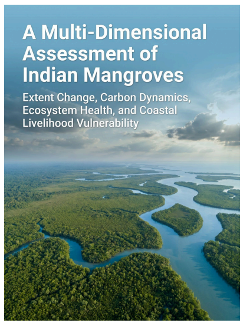

# Indian Mangrove Health Analysis
<p align="center">

</p>

<p align="center">

**Remote Sensing • R • Climate Analytics • Carbon Dynamics • Ecosystem Health**

*A reproducible R workflow for analysing mangrove canopy health, carbon dynamics, and ecosystem condition across India's mangrove ecosystems using Landsat, MODIS, and Google Earth Engine.*

</p>

---

## Overview

Mangroves are among the world's most productive and carbon-rich ecosystems. Besides storing significant quantities of blue carbon, they provide coastal protection, biodiversity conservation, and livelihood support for millions of people.

This repository contains the **R-based analytical workflow** developed as part of the research project:

> **A Multi-Dimensional Assessment of Indian Mangroves: Extent Change, Carbon Dynamics, Ecosystem Health, and Coastal Livelihood Vulnerability**

The project integrates remote sensing, statistical modelling, and ecological indicators to evaluate mangrove ecosystem health and its relationship with carbon dynamics across India's coastal states and union territories.

---

# Research Objectives

The complete research consisted of four interconnected objectives.

| Objective | Description |
|-----------|-------------|
| O1 | Mangrove Cover Trend Analysis |
| O2 | Carbon Stock Estimation & Economic Valuation |
| **O3** | **Mangrove Canopy Health Assessment (Implemented in this Repository)** |
| **O4** | **Coastal Community Vulnerability Assessment (Implemented in this Repository)** |

This repository primarily contains the implementation for **Objective 3 and 4**, together with supporting analyses used for validation and vulnerability assessment.

---

# Study Area

The study covers **12 coastal administrative regions of India** containing mangrove ecosystems.
<p align="center">

</p>

### States

- Andhra Pradesh
- Goa
- Gujarat
- Karnataka
- Kerala
- Maharashtra
- Odisha
- Tamil Nadu
- West Bengal

### Union Territories

- Andaman & Nicobar Islands
- Daman & Diu
- Puducherry

---

# Data Sources

The workflow integrates multiple national and global datasets.

| Dataset | Purpose |
|---------|---------|
| Landsat 5/7/8/9 | Spectral indices |
| MODIS | Carbon density modelling |
| ESA WorldCover | Mangrove masking |
| Forest Survey of India | Mangrove extent & carbon |
| CMFRI Fisheries Census | Livelihood indicators |
| Census of India | Population statistics |

---

# Methodology

The workflow follows six major stages.

```text
Satellite Data
        │
        ▼
Image Pre-processing
        │
        ▼
Mangrove Masking
        │
        ▼
Spectral Indices
(NDVI • EVI • MVI)
        │
        ▼
Trend Analysis
        │
        ▼
ARIMA Forecasting
        │
        ▼
Carbon Density Estimation
        │
        ▼
Correlation Analysis
        │
        ▼
Validation
        │
        ▼
Socio-Ecological Vulnerability Assessment
```

---

# Spectral Indices

Three vegetation indices were analysed.

### NDVI

Evaluates vegetation greenness and photosynthetic activity.

### EVI

Captures dense canopy structure while minimizing atmospheric and soil effects.

### MVI

A mangrove-specific vegetation index designed for coastal environments.

---

# Repository Structure

```
Indian-Mangrove-Health-Analysis

├── R
│   ├── 01_time_series_analysis.R
│   ├── 02_carbon_estimation.R
│   ├── 03_correlation_analysis.R
│   ├── 04_inventory_validation.R
│   └── 05_vulnerability_assessment.R
│
├── data
│   ├── raw
│   └── processed
│
├── images
│
├── outputs
│   ├── figures
│   └── tables
│
├── docs
│
└── paper
```

---

# Analytical Workflow

✔ Data Cleaning

✔ Time Series Analysis

✔ Trend Detection

✔ ARIMA Forecasting

✔ Carbon Estimation

✔ Regression Analysis

✔ Validation

✔ Vulnerability Assessment

---

# Results

The workflow generates:

- Mangrove canopy health trends
- NDVI, EVI and MVI forecasts
- Carbon stock density estimation
- Spectral index–carbon relationships
- Inventory validation
- State-wise socio-ecological vulnerability profiles

---

# Software

- R
- RStudio
- Google Earth Engine
- Landsat
- MODIS
- ArcGIS Pro

---

# Repository Status

🟢 Active Development

Additional documentation, workflow diagrams, and reproducible examples will be added in future releases.

---

# Citation

If you use this repository in your research, please cite the associated research project and acknowledge the data providers.

---

# Author

**Jyotiprakash Mirashi**

M.Sc. Climate Change & Sustainability

Azim Premji University

Climate Analytics • Remote Sensing • GIS • Sustainability

---

# License

Released under the MIT License.

